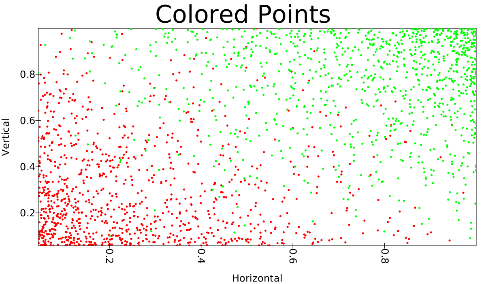
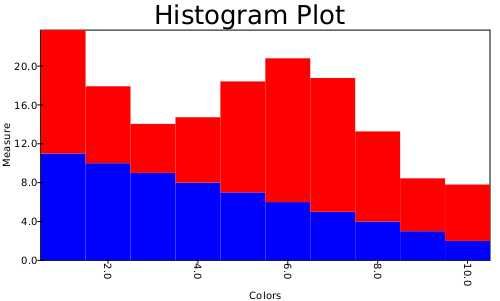
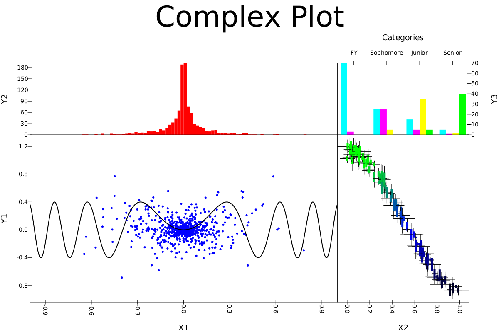

# SwiftVis 2 Examples

This is where you can find various examples of SwiftVis2 usage. Until this is finished, you'll find code to produce the testings plots
in [playground.PlotTesting](https://github.com/MarkCLewis/SwiftVis2/blob/master/src/main/scala/playground/PlotTesting.scala).

## Programmatic Usage

### Scatter Plots

### Histogram

### Bar Charts

### Full Plotting Capabilities

## Graphical Interface Usage

The graphical interface isn't currently implemented.