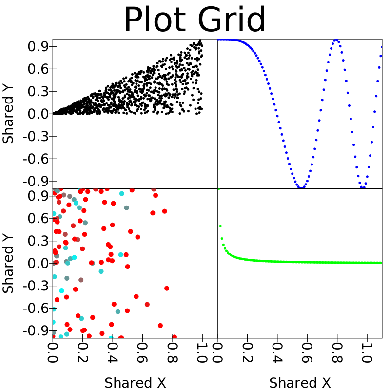
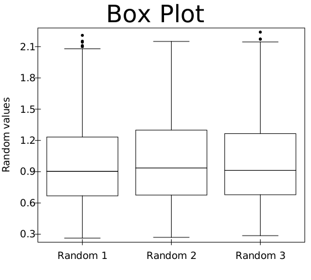
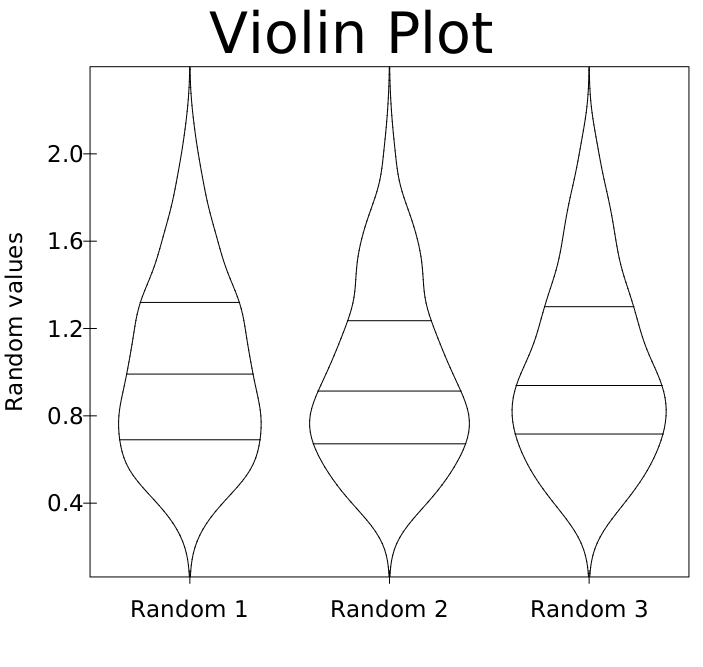

# SwiftVis 2 Examples

This is where you can find various examples of SwiftVis2 usage. Until this is finished, you'll find code to produce the testings plots
in [playground.PlotTesting](https://github.com/MarkCLewis/SwiftVis2/blob/master/src/main/scala/playground/PlotTesting.scala). Code that renders the plots can also be found for 
the [FXRenderer](https://github.com/MarkCLewis/SwiftVis2/blob/master/src/main/scala/playground/JFXPlotTesting.scala), 
the [SwingRenderer](https://github.com/MarkCLewis/SwiftVis2/blob/master/src/main/scala/playground/SwingPlotTesting.scala), 
and the [SVGRenderer](https://github.com/MarkCLewis/SwiftVis2/blob/master/src/main/scala/playground/SVGPlotTesting.scala).
For normal display purposes, we recommend that you use the SwingRenderer both for simplicity and speed. The only advantage of the FXRenderer is that it displays incrementally so you will see stuff being drawn before it is all finished.

## Programmatic Usage

I'm working first to develop the ability to do programmatic plotting. A big part of the goal here is to make something that people can use to quickly
and easily plot data with Spark when using Scala. For that reason, I have defined a number of facade methods in the `Plot` object that provide a
simple interface for producing plots.

### Original Facade

The original facade for SwiftVis included a number of methods for producing specific types of plots. These are listed first here because they show
you the different styles of plots supported by SwiftVis2, but for a lot of purposes you will probably find that the new facade, described below,
is superior as it gives you a bit more control and allows you to mix different types of plot styles in a single plot.

#### Scatter Plots

This is almost certainly the most common plot style in scientific plotting. As such, it is well developed in SwiftVis2. In addition to the standard
abilities to provide x and y values for points, the SwiftVis2 scatter plot allows you to provide per point colors, point sizes, and error bars.
The points can also be connected with lines using a mechanism that allows you to make multiple line plots from a single set of data.

Here is a simple example of two data sets plotted in different colors that share the same axes. Note that all code samples assume data is defined in arrays or sequences of `Double`s.

```scala
Plot.scatterPlots(
  Seq((x1, y1, RedARGB, 5), (x2, y2, GreenARGB, 5)),
  title = "Colored Points", xLabel = "Horizontal", yLabel = "Vertical")
```


#### Scatter Plot Grid

SwiftVis2 plots are really just combinations of a few basic elements including text and plot grids. Most of the time people use 1x1 grids to have all
plots in a single area as the example above demonstrates. There is a simple facade method that makes regular grids of scatter plots like the example
below. 

```scala
Plot.scatterPlotGrid(
  Seq(
    Seq((x1, y1, BlackARGB, 5), (x2, y2, BlueARGB, 5)),
    Seq((x3, y3, cg(c3), 10), (x4, y4, GreenARGB, 5))),
  "Plot Grid", "Shared X", "Shared Y")
```



#### Histogram

The histogram style can be drawn with values stacked or not. It can also draw the bins either centered on the bin value or spanning the bin values.
Note that the histogram method in Spark produces the latter option. This is significant as when you don't center, the bin data needs to have one more
element than the counts.

```scala
Plot.stackedHistogramPlot(bins, Seq(
		DataAndColor(counts1, BlueARGB), 
		DataAndColor(counts2, RedARGB)), 
  true, "Histogram Plot", "Value", "Count")
```


#### Bar Charts

The bar chart utilizes a categorical axis. The bars can be drawn side-by-side or stacked.

```scala
Plot.barPlot(categories, Seq(
		DataAndColor(values1, YellowARGB), 
		DataAndColor(values2, MagentaARGB)), 
  true, 0.8, "Bar Plot", "Colors", "Measure")
```


#### Box Plots

The box plot has a categorical X-axis and a numeric Y-axis. The user can provide whatever values desired for the data on the boxes, but a convenience
method in the companion object calculates the quartiles and puts the min and max values no more than 1.5 IRQs above or below the quartiles, then draws
outliers beyond those values. 

```scala
Plot.boxPlot(categories, data, title = "Box Plot", yLabel = "Random values")
```



#### Violin Plots

The violin plot has a categorical X-axis and a numeric Y-axis. The user provides the data and an option bandwith. The density function is approximated
using normal kernels and lines are drawn for the quartiles.

```scala
Plot.violinPlot(categories, data, title = "Violin Plot", yLabel = "Random values")
```



### Updated Facade

The updated facade includes methods that allow you to put different plot
styles in a single plot. They let you pass in the various plot styles and there
are different options for the axis tpes that are used.

#### Simple

#### Stacked

#### Row

#### Column - TODO

#### Stacked Numeric-Numeric

#### Grid Numeric-Numeric

#### Stacked Category-Numeric

#### Grid Category-Numeric

### Fluent Interface

The methods in the facade can't handle all the possiblities that some might 
want for their plots. One way to deal with this is to use the facade to build 
a plot that is close to what you want, then use the fluent interface to alter 
some element of it to match what you really want.

### Long-form/Non-facade

All the plots above were made using facade methods that provide a shortcut syntax. However, you can also construct your own plot grids with whatever
plot styles and axes you want, with variable width rows and columns. An example of this, which also shows many of the different capabilities of SwiftVis2
is shown here.


## Graphical Interface Usage

The graphical interface isn't currently implemented.
